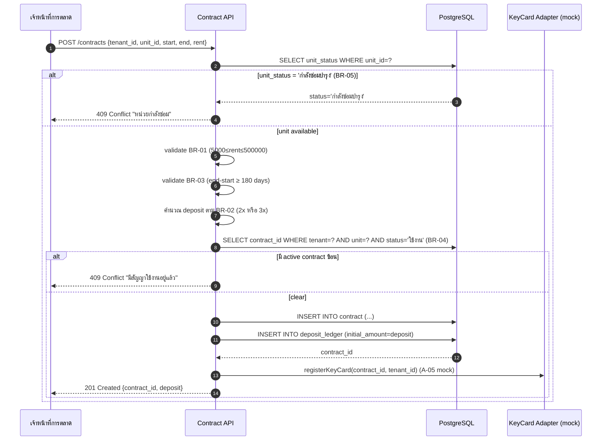

# Technical Spec — Rental Contract Module

> **Reference output สำหรับ Demo A** · ใช้คู่กับ `system_analysis.md` (BR-01..BR-08) และ `er_diagram.mmd`

---

## 1. API Endpoints

| Method | Path | Auth | Request Body | Response | Story Pts |
|---|---|---|---|---|---|
| POST | `/api/v1/contracts` | Marketing | `{tenant_id, unit_id, start_date, end_date, monthly_rent}` | `201 {contract_id, deposit, status}` | 5 |
| GET | `/api/v1/contracts` | All | query: `status`, `tenant_id`, `unit_id`, `page`, `limit` | `200 {items[], total, page}` | 3 |
| GET | `/api/v1/contracts/:id` | All | — | `200 {contract + tenant + unit + payments}` | 2 |
| PUT | `/api/v1/contracts/:id/renew` | Marketing | `{new_end_date, new_monthly_rent}` | `200 {new_contract_id}` | 5 |
| DELETE | `/api/v1/contracts/:id` | Marketing | — | `204 No Content` (soft delete → status='ยกเลิก') | 2 |
| POST | `/api/v1/invoices/generate` | Finance/Cron | `{billing_month}` | `202 Accepted {batch_id}` | 5 |
| POST | `/api/v1/payments` | Finance | `{invoice_id, amount_paid, method, paid_date}` | `201 {payment_id, receipt_no}` | 3 |
| GET | `/api/v1/dashboard/kpi` | Executive | query: `period` | `200 {occupancy_rate, revenue, overdue_total}` | 8 |
| POST | `/api/v1/contracts/:id/refund-deposit` | Finance | `{refund_amount, deduction_notes}` | `200 {ledger_id}` | 3 |

**Total estimated effort:** 36 SP (~3-4 sprints สำหรับทีม 3 คน)

---

## 2. PostgreSQL DDL

```sql
-- ============================================
-- Rental Contract Module — DDL
-- PostgreSQL 14+ · pgcrypto extension required
-- ============================================

CREATE EXTENSION IF NOT EXISTS pgcrypto;

-- TENANT — ผู้เช่า (NFR-05: encrypt national_id)
CREATE TABLE tenant (
    tenant_id           BIGSERIAL PRIMARY KEY,
    national_id_enc     BYTEA NOT NULL UNIQUE,           -- encrypted with pgp_sym_encrypt
    full_name           VARCHAR(200) NOT NULL,
    phone               VARCHAR(20),
    email               VARCHAR(120),
    previous_address    TEXT,
    created_at          TIMESTAMPTZ NOT NULL DEFAULT now()
);

CREATE INDEX idx_tenant_email ON tenant(email);

-- UNIT — หน่วยเช่า
CREATE TABLE unit (
    unit_id         VARCHAR(30) PRIMARY KEY,             -- UNIT-A-0301, SHOP-G-0012
    unit_type       VARCHAR(30) NOT NULL
                    CHECK (unit_type IN ('คอนโด','ร้านค้า','สำนักงาน')),
    size_sqm        DECIMAL(8,2),
    floor           INT,
    standard_rent   DECIMAL(12,2),
    unit_status     VARCHAR(20) NOT NULL DEFAULT 'ว่าง'
                    CHECK (unit_status IN ('ใช้งาน','ว่าง','กำลังซ่อมบำรุง'))   -- BR-05
);

-- CONTRACT — สัญญาเช่า (entity หลัก)
CREATE TABLE contract (
    contract_id         VARCHAR(20) PRIMARY KEY,         -- RC-2025-0001
    tenant_id           BIGINT NOT NULL REFERENCES tenant(tenant_id),
    unit_id             VARCHAR(30) NOT NULL REFERENCES unit(unit_id),
    start_date          DATE NOT NULL,
    end_date            DATE NOT NULL,
    monthly_rent        DECIMAL(12,2) NOT NULL
                        CHECK (monthly_rent BETWEEN 5000 AND 500000),    -- BR-01
    deposit             DECIMAL(12,2) NOT NULL,                          -- BR-02 enforce in app layer
    status              VARCHAR(20) NOT NULL DEFAULT 'ใช้งาน'
                        CHECK (status IN ('ใช้งาน','หมดอายุ','ยกเลิก')), -- BR-08
    contract_pdf_path   TEXT,
    created_at          TIMESTAMPTZ NOT NULL DEFAULT now(),

    -- BR-03: contract duration ≥ 180 days
    CONSTRAINT chk_contract_duration
        CHECK (end_date - start_date >= 180),

    -- BR-04: ผู้เช่าเดียว+หน่วยเดียว ห้าม status='ใช้งาน' ซ้อนกัน
    -- (enforce via partial unique index ด้านล่าง)
    CONSTRAINT chk_dates_order
        CHECK (end_date > start_date)
);

-- BR-04 enforcement: 1 active contract ต่อ tenant+unit
CREATE UNIQUE INDEX uq_contract_active
    ON contract(tenant_id, unit_id)
    WHERE status = 'ใช้งาน';

CREATE INDEX idx_contract_status ON contract(status);
CREATE INDEX idx_contract_end_date ON contract(end_date);     -- BR-07 notification job

-- INVOICE — ใบแจ้งหนี้
CREATE TABLE invoice (
    invoice_id      BIGSERIAL PRIMARY KEY,
    contract_id     VARCHAR(20) NOT NULL REFERENCES contract(contract_id),
    issue_date      DATE NOT NULL,
    due_date        DATE NOT NULL,
    amount          DECIMAL(12,2) NOT NULL CHECK (amount > 0),
    status          VARCHAR(20) NOT NULL DEFAULT 'ค้างชำระ'
                    CHECK (status IN ('ค้างชำระ','ชำระแล้ว','เกินกำหนด')),

    CONSTRAINT chk_due_after_issue CHECK (due_date >= issue_date)
);

CREATE INDEX idx_invoice_contract ON invoice(contract_id);
CREATE INDEX idx_invoice_due_date ON invoice(due_date) WHERE status = 'ค้างชำระ';   -- BR-06

-- PAYMENT — บันทึกชำระ
CREATE TABLE payment (
    payment_id      BIGSERIAL PRIMARY KEY,
    invoice_id      BIGINT NOT NULL UNIQUE REFERENCES invoice(invoice_id),
    paid_date       DATE NOT NULL,
    amount_paid     DECIMAL(12,2) NOT NULL CHECK (amount_paid > 0),
    method          VARCHAR(20) NOT NULL
                    CHECK (method IN ('เงินสด','โอน','บัตรเครดิต')),
    receipt_no      VARCHAR(30) NOT NULL UNIQUE
);

-- DEPOSIT_LEDGER — บันทึกเงินประกัน + การคืน (UC-08, A-03)
CREATE TABLE deposit_ledger (
    ledger_id           BIGSERIAL PRIMARY KEY,
    contract_id         VARCHAR(20) NOT NULL UNIQUE REFERENCES contract(contract_id),
    initial_amount      DECIMAL(12,2) NOT NULL,
    refund_amount       DECIMAL(12,2),
    refund_date         DATE,
    deduction_notes     TEXT,                     -- A-03: free-text จาก Finance

    CONSTRAINT chk_refund_logic
        CHECK ((refund_amount IS NULL AND refund_date IS NULL)
            OR (refund_amount IS NOT NULL AND refund_date IS NOT NULL))
);
```

> **Verify:** `psql --dry-run -f tech_spec.ddl` — ต้องไม่มี syntax error

---

## 3. Sequence Diagram — Create Contract Flow



---

## 4. Validation Rules Table

| Rule ID | Field | Validation | Layer | Cross-ref |
|---|---|---|---|---|
| V-01 | `monthly_rent` | 5000 ≤ x ≤ 500000 | DB CHECK + API | **BR-01** |
| V-02 | `deposit` | = rent × 2 (residential) หรือ × 3 (commercial) | API service | **BR-02** |
| V-03 | `end_date - start_date` | ≥ 180 days | DB CHECK + API | **BR-03** |
| V-04 | (`tenant_id`, `unit_id`, `status='ใช้งาน'`) | unique combination | DB partial unique idx | **BR-04** |
| V-05 | `unit_status` | ต้อง ≠ 'กำลังซ่อมบำรุง' ตอน create contract | API service (pre-check) | **BR-05** |
| V-06 | `payment.paid_date - invoice.due_date` | ถ้า > 15 วัน → enqueue KeyCardLockJob | Background job | **BR-06** |
| V-07 | `contract.end_date - now()` | = 60 วัน → enqueue NotificationJob (UC-04) | Cron job daily 06:00 | **BR-07** |
| V-08 | `contract.status` | enum {ใช้งาน, หมดอายุ, ยกเลิก} | DB CHECK | **BR-08** |
| V-09 | `tenant.national_id_enc` | encrypted via pgp_sym_encrypt; UI mask 9 digits | API + Frontend | **NFR-05** |
| V-10 | RBAC | endpoint mapping: Marketing/Finance/Executive | Middleware (JWT claims) | **NFR-04** |

---

## 5. Story Point Summary

| Sprint | Endpoints / Job | SP | Dependencies |
|---|---|---|---|
| Sprint 1 | tenant CRUD + unit CRUD + auth/RBAC | 8 | — |
| Sprint 2 | POST + GET contracts + DDL (BR-01..BR-04) | 10 | Sprint 1 |
| Sprint 3 | invoice generation + payment + BR-06 lock job | 11 | Sprint 2 |
| Sprint 4 | dashboard KPI + renew + refund-deposit | 11 | Sprint 3 |
| Buffer | KeyCard real adapter (after A-05 confirmed) + accounting export (A-04) | 5 | external |

**Total: 45 SP** (45 SP × ~6 hr/SP / 3 dev = ~90 dev-days = ~4 sprints + 1 sprint buffer ≈ ใกล้เคียง 4 เดือนตาม budget)

---

## Cross-check Summary (สำหรับ instructor)

| Output artifact | สิ่งที่ตรวจ | ผ่าน |
|---|---|---|
| API table | 9 endpoints (ขั้นต่ำ 5) | ✅ |
| DDL | 6 tables, ทุก field match CSV header (สำหรับ contract) | ✅ |
| CHECK constraints | link BR-01, BR-03, BR-05, BR-08 (BR-02/04/06/07 ใน app layer) | ✅ |
| Sequence diagram | แสดง validation steps + BR cross-ref | ✅ |
| Validation rules | 10 rules ทั้งหมด link BR-XX หรือ NFR-XX | ✅ |
| Story points | ครบทุก endpoint (Fibonacci 2/3/5/8) | ✅ |

---

*Generated: workshop reference output · ใช้สำหรับ instructor fallback ถ้า live demo ไม่ได้ผล*
